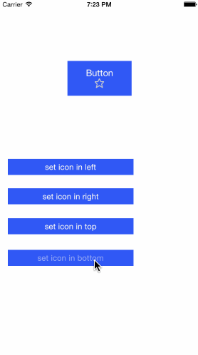

# TQEasyIconButton

TQEasyIconButton is a UIButton Category. Easy way to set `titleEdgeInsets`,`imageEdgeInsets` make icon in left,right,top,bottom.

##Demo



##Usage

1. Set icon & title for button.

	```objective-c

	[self.demoButton setTitle:@"Button" forState:UIControlStateNormal];
	[self.demoButton setImage:@"icon" forState:UIControlStateNormal];

	```

2. Set icon left,title right

	 


	```objective-c

	[self.demoButton setIconInLeft];
	// or
	//[self.demoButton setIconInLeftWithSpacing:0];

	```

	

	```objective-c

	[self.demoButton setIconInRight];
	// or
	//[self.demoButton setIconInRightWithSpacing:0];

	```

	

	```objective-c

	[self.demoButton setIconInBottom];
	// or
	//[self.demoButton setIconInBottomWithSpacing:0];
	
	```

	

	```objective-c
	
	[self.demoButton setIconInBottom];
	// or
	//[self.demoButton setIconInBottomWithSpacing:0];

	```


  
